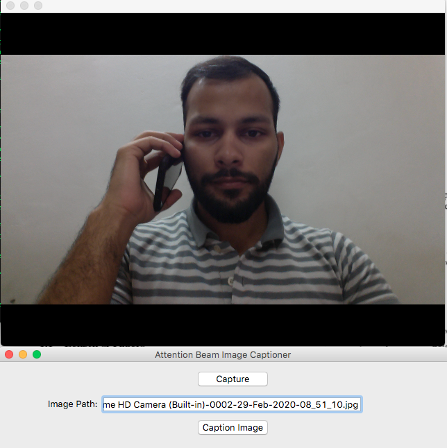
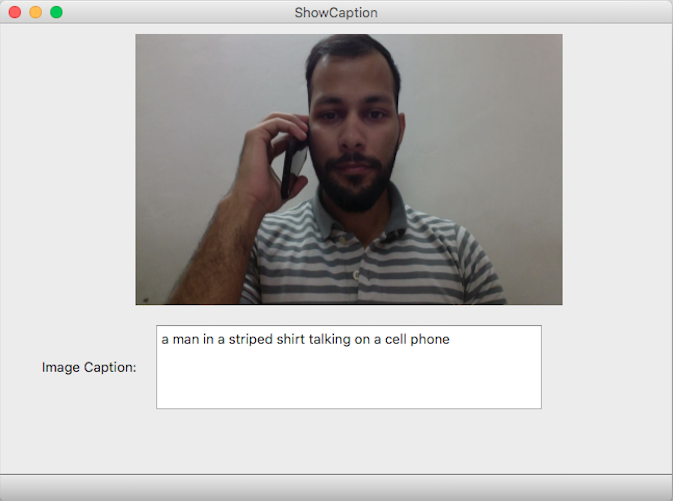

# Attention-Beam-Image-Captioning

We present a heuristic of beam search on top of the encoder-decoder based architecture that gives better quality captions on three benchmark datasets: Flickr8k, Flickr30k and MS COCO.

Beam search helps in finding the most optimal caption that can be generated by the model instead of greedily choosing the word with best score at each decoding step. Following shows how a beam width (k) of 3 helps in generating better captions:


## Dependencies

For dependencies related to this project, `environment.yml` and `requirements.txt` files have been provided.

To install the dependencies using conda: 

```bash
conda env create -f environment.yml
conda env list
```

## Training

Reference data folder and annotations json file for the downloaded dataset (MSCOCO, Flickr8k, Flickr30k) in `create_input_files.py` and run the python script to create the required dataset.

To train a model run `python train.py`.
All training hyper-parameters are mentioned in `train.py`.

**Note: Pretrained models for MSCOCO, Flickr8k, Flickr30k can be downloaded from [here](https://drive.google.com/file/d/1kPeKtfuBNjFslJ33ftbNtygtE1NM0n7L/view?usp=sharing).**

## Testing / Inference

* You may use `caption.py` to generate image captions and attention map over an image.

  ```
  python caption.py --img='path/to/image.jpeg' --model='path/to/BEST_checkpoint_coco_5_cap_per_img_5_min_word_freq.pth.tar' --word_map='path/to/WORDMAP_coco_5_cap_per_img_5_min_word_freq.json' --beam_size=5
  ```

* The Jupyter Notebook `Caption-Sample-Images.ipynb` can be used to caption specified images using the trained model.
* `Generate-Testset-Predictions.ipynb` is used for generating predictions in the required format for the testing dataset.

## Results


<div style='text-align: center;'>
  
  
</div>
<div style='text-align: center;'>
  
  
</div>
<div style='text-align: center;'>
  
  
</div>

## Intercative User Interface

To use the UI based image captioner module run the following commands:

```bash
cd ui/
python MainWindowUI.py 
```

This would open the following user interface:

<div style='text-align: center;'>
  
  
</div>
